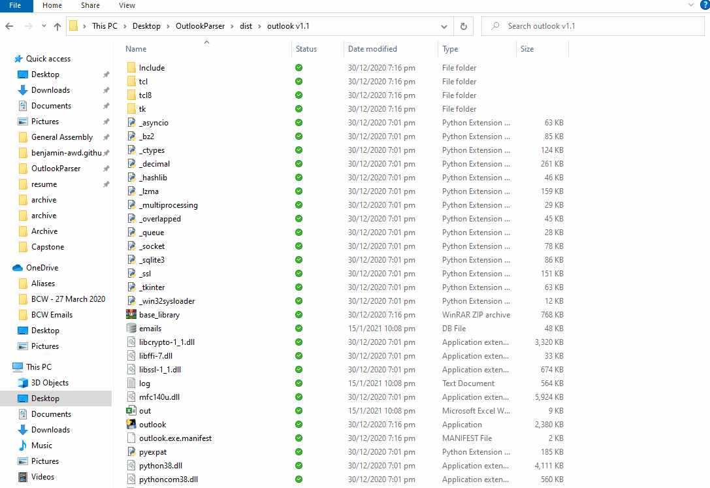

# About OutlookParser
Welcome to OutlookParser! As part of my final project for [Harvard's CS50x](https://cs50.harvard.edu/x/2020/), I decided to create an application that can parse emails, then save and write information from those emails to an Excel spreadsheet.

This application was created with the goal of automating a work process involving media monitoring i.e. saving and compiling details such as the date and title of a news article to an Excel spreadsheet.

<p align="center">

</p>

Please note that this email parser was created for a very specific use case. However, you should be able to repurpose the code for your own projects. A more detailed breakdown of the code is available on [Medium](https://towardsdatascience.com/creating-an-email-parser-with-python-and-sql-c79cb8771dac).

# Description
## Email Parser
The email parser functions by querying the user for a folder path. The parser then checks for emails in the folder, and iterates over each email.

Using Python for Windows Extensions (pywin32), each email is opened in Microsoft Outlook with the email body extracted as HTML. 

This allows the use of regex to search for a specific pattern, which in my case, was a bullet point list like this:

* **New Arrival: Dell G Series Gaming Computers, Monitors & Keyboards – Tech4tea ([Online](http://tech4tea.com/blog/2020/06/26/new-arrival-dell-g-series-gaming-computers-monitors-keyboards/), [Facebook](https://business.facebook.com/gotech4tea/posts/4598490146843826) & [LinkedIn](https://www.linkedin.com/feed/update/urn:li:activity:6682511823100542976/))**

Which then can be translated to the following HTML:
``` HTML
<li class=MsoListParagraph style='margin-left:0cm;mso-list:l0 level1 lfo1'><b><span lang=EN-US style='font-size:10.0pt;font-family:"Arial",sans-serif'>New Arrival: Dell G Series Gaming Computers, Monitors &amp; Keyboards &#8211; Tech4tea (<a href="http://tech4tea.com/blog/2020/06/26/new-arrival-dell-g-series-gaming-computers-monitors-keyboards/">Online</a>, <a href="https://business.facebook.com/gotech4tea/posts/4598490146843826">Facebook</a> &amp; <a href="https://www.linkedin.com/feed/update/urn:li:activity:6682511823100542976/">LinkedIn</a>) <o:p></o:p></span></b></li>
```

which is then identified by the following regex:
``` python
pattern = r"li class=MsoListParagraph([\s\S]*?)</li>"
regex = re.findall(pattern, msg.HTMLbody)
```

From here, additional regex is used to extract details including title, date, media types and links from the HTML. These details are then uploaded to a local SQL database.

For example, to extract hyperlinks, the following code can be used:
``` python
links = re.findall(r"<a href=\"([\s\S]*?)\">", header)
```

## Excel Writer
The excel writer uses information from the SQL database to write multiple columns and rows. 

Due to the specific formatting requirements, a function was created to write additional rows containing media articles that were syndicated from the main publication to platforms like Facebook or Twitter.

The excel writer creates rows according to information in the database, and creates a spreadsheet which ultimately reduces the need for manual formatting, as hyperlinking and  cell formatting are handled by the program.

Yay to automation!

# Usage
You'll first need to install the packages listed in requirements.txt -- namely PyWin32 and XlsxWriter.

To make this portable (e.g. for someone that might not necessarily use an IDE) I used pyinstaller to create an executable file.
``` python
> pyi-makespec outlook.py excel.py setup_db.py
> pyinstaller outlook.spec
```

This boils down to three simple steps:
1. Export emails in .msg format to a folder. Alternatively, you can drag or drop emails from your inbox to a folder on your hard drive.
2. Run outlook.exe and select the folder with the emails when prompted.
3. Wait for the Excel sheet to open.

Voila!